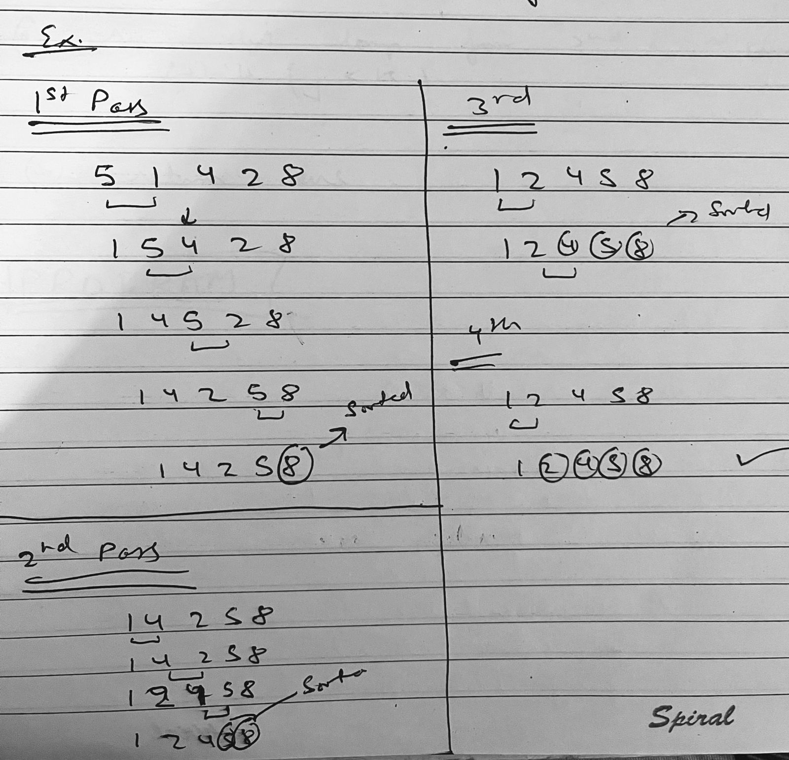

# Data-structures

Data Structure questions using java programming Language.

---

# Sorting

<pre>
1. Bubble sort    [simple]
2. Insertion sort [simple]
3. Selection sort [simple]

4. Merge sort     [divide & conquer]
5. Quick sort     [divide & conquer]

6. Counting sort

7. Radix sort   [extra]
8. Shell sort   [extra]
</pre>

### Stablility of sorting algoritms

A Sorting algo is said to be stable if 2 objects with equal keys appear in same order in sorted outpust as appear in input array to be sorted

ex.... 10, 20, 20\*, 30, 10

output 10, 10, 20, 20*, 30 // here 20* appear in same place after and before sorting w.r.t 20

Stable algo: bubble insertion, merge, count
Unstable algo: quick, heap sort selection sort

Note: Any given algo which is not stable can be made stable

## Bubble Sort

- It is the simplest sorting algorithm that works by **repeateadly swapping adjacent elements** if they are not in correct order.
- This algo is not suitable for larger data set as it avg and worst cast time complexity is `O(n^2)`.

```
public static void bubble_sort(int[] arr) {

   for (int i = 0; i <= arr.length; i++) {
      for (int j = i + 1; j < arr.length; j++) {
         if (arr[i] > arr[j]) { // swapping
            int temp = arr[i];
            arr[i] = arr[j];
            arr[j] = temp;
         }
      }
   }

   for (int i : arr) {
      System.out.println(i);
   }
}
```

| Property       | Values           |
| -------------- | ---------------- |
| T.C            | `O(n^2)`         |
| Auxilary Space | `O(1)`           |
| in-place       | yes              |
| stable         | no (can be made) |

### [iterations]

| 0   | 1   | 2   | 3   | 4   | 5   | 6   | 7   | 8   | description                                             |
| --- | --- | --- | --- | --- | --- | --- | --- | --- | ------------------------------------------------------- |
| -6  | 20  | 48  | 1   | 5   | 7   | 9   | 100 | -7  | **[unsorted array]**                                    |
| -7  | 20  | 48  | 1   | 5   | 7   | 9   | 100 | -6  | **[-7 act as bubble and it is in it correct position]** |
| -7  | -6  | 48  | 20  | 5   | 7   | 9   | 100 | 1   | **[-6 is in its correct postion]**                      |
| -7  | -6  | 1   | 48  | 20  | 7   | 9   | 100 | 5   | **[1 is in correct position]**                          |
| -7  | -6  | 1   | 5   | 48  | 20  | 9   | 100 | 7   | **[5 is in correct postion]**                           |
| -7  | -6  | 1   | 5   | 7   | 48  | 20  | 100 | 9   | **[7 is in its correct]**                               |
| -7  | -6  | 1   | 5   | 7   | 9   | 48  | 100 | 20  |                                                         |
| -7  | -6  | 1   | 5   | 7   | 9   | 20  | 100 | 48  |                                                         |
| -7  | -6  | 1   | 5   | 7   | 9   | 20  | 48  | 100 |                                                         |
| -7  | -6  | 1   | 5   | 7   | 9   | 20  | 48  | 100 |                                                         |
| -7  | -6  | 1   | 5   | 7   | 9   | 20  | 48  | 100 |                                                         |



Optimization
: If inner loop don't swap just break the outer loop.

```
   public static void bubble_sort(int[] arr) {
      boolean swapped = false;
      for (int i = 0; i <= arr.length; i++) {
         for (int j = i + 1; j < arr.length; j++) {
            if (arr[i] > arr[j]) {
               int temp = arr[i];
               arr[i] = arr[j];
               arr[j] = temp;
               swapped = true;
            }
         }
         if (!swapped) {
            break; // break if array is already sorted
         }
      }
   }
```

> **best case** time complexity would be `O(n)`, worst and avg case still `O(n^2)`

---

## Insertion sort

* simple sorting algo works similart of the way we sort playing card in our hands.
* array is split virtually into sorted and unsorted array.
* **values from unsorted part is picked** and **inserted at the correct postion in  sorted part** that is why it is known as **insertion sort**

---

## Selection Sort

- simple sorting algo
- in-place comparison based algo
- in this list is divided into 2 sets - sorted and unsorted
- initially sorted part is empty and unsorted part is entire array
- the **smallest element** from unsorted is array **is selected** and **swapped with the left most element** and becomes ths part of left most array. (we can also select largest element and swap it with rightmost element)
- This algo is not suitable for larger data set as it avg and worst cast time complexity is `O(n^2)`

```
public static void selection_sort(int arr[]) {

   for (int i = 0; i < arr.length; i++) {
      int min_index = i;
      // we will find smallest element index
      for (int j = i + 1; j < arr.length; j++) {
         if (arr[min_index] > arr[j]) {
            min_index = j;
         }
      }

      // swapping
      if (arr[i] > arr[min_index]) {
         arr[i] = arr[i] - arr[min_index];
         arr[min_index] = arr[i] + arr[min_index];
         arr[i] = arr[min_index] - arr[i];
      }
   }

   for (int e : arr) {
      System.out.println(e);
   }
}
```

### [iterations]

| 0   | 1   | 2   | 3   | 4   | 5   | description            |
| --- | --- | --- | --- | --- | --- | ---------------------- |
| -6  | 20  | 48  | 1   | 1   | -7  | unsorted array         |
| -7  | 20  | 48  | 1   | 1   | -6  | -7 smallest and sorted |
| -7  | -6  | 48  | 1   | 1   | 20  | -6 smallest and sorted |
| -7  | -6  | 1   | 48  | 1   | 20  | 1 smallest and sorted  |
| -7  | -6  | 1   | 1   | 48  | 20  | 1 smallest and sorted  |
| -7  | -6  | 1   | 1   | 20  | 48  | 20 smallest and sorted |
| -7  | -6  | 1   | 1   | 20  | 48  | 48 smallest and sorted |

| Property       | Values           |
| -------------- | ---------------- |
| T.C            | `O(n^2)`         |
| Auxilary Space | `O(1)`           |
| in-place       | yes              |
| stable         | no (can be made) |

- stable selection sort - selection sort works by finding the min element & swapping it in the correct position this is what makes it unstable.

- selection sort can be made stable if instead of swapping the minimum elment is placed in the position without swapping i.e. by placing the element pushing one elements forward.

```
public static void stable_selection_sort(int arr[]) {
   int n = arr.length;
   for(int i = 0; i < n; i++) {
      int min = i;
      for (int j = i + 1; j < n; j++) {
         if (arr[min] > arr[j]) {
            min = j;
         }
      }
      int key = arr[min];

      while (min > i) {
         arr[min] = arr[min-1];
         min--;
      }
      arr[i] = key;
   }

   for (int e : arr) {
      System.out.print(e + " ");
   }
}
```

---

| Property       | Values |
| -------------- | ------ |
| T.C            | `O()`  |
| Auxilary Space | `O()`  |
| in-place       |        |

---

**Note:**

| Bubble sort                                                             | selection sort                                                                                                           |
| ----------------------------------------------------------------------- | ------------------------------------------------------------------------------------------------------------------------ |
| Bubble sort compares the adjacent elements and move accordingly.        | Selection sort selects the smallest element from the unsorted list and moves it at the next position of the sorted list. |
| Bubble sort performs a large number of swaps or moves to sort the list. | Selection sort performs comparatively less number of swaps or moves to sort the list.                                    |
| Bubble sort is relatively slower.                                       | Selection sort is faster as compared to bubble sort.                                                                     |


